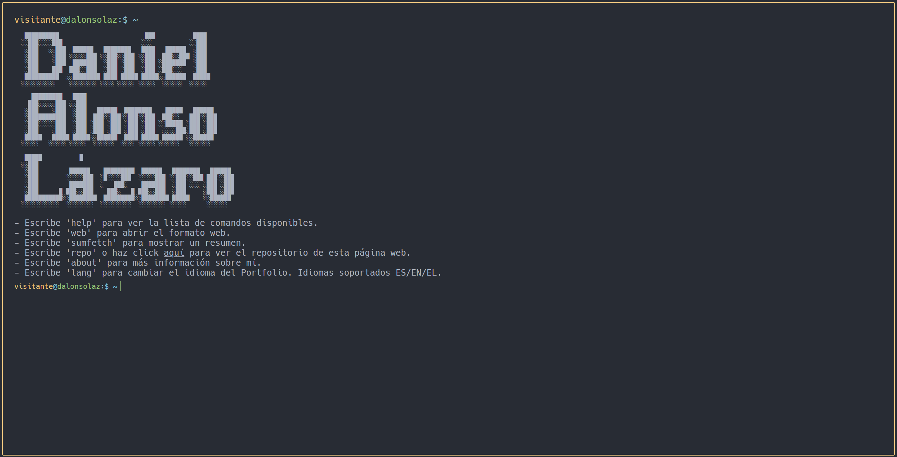

# PortFolio - Terminal




Este es un proyecto creado 'for fun' para poner en práctica todas las habilidades adquiridas durante el Grado Superior de Desarrollo de Aplicaciones Web y las habilidades que he ido adquiriendo por mi cuenta.

Además, sirve un propósito muy importante: es un portfolio personal para proporcionar a los visitantes, posibles empleadores, clientes, etc. información sobre mí, mis habilidades, mis proyectos y la experiencia adquirida.


## Tabla de Contenidos

- [Descripción](#descripción)
- [Tecnologías](#tecnologías)
  - [Frontend](#frontend)
  - [Servidor](#servidor)
  - [Tooling](#tooling)
- [Instalación](#instalación)
- [Uso](#uso)
- [Contribuciones](#contribuciones)
- [Licencia](#licencia)
- [Autor](#autor)
- [Social](#social)

## Descripción

Como declaración de intenciones de mi fuerte inclinación hacia el backend, este proyecto de portfolio personal simula una terminal de bash interactiva. Esta terminal intenta ofrecer una sensación de terminal, contando con autocompletado de comandos, con comandos propios de entornos *NIX permitiendo la navegación por las distintas secciones del portfolio. También cuenta con unos cuantos easter eggs y comandos ocultos que te invito a descubrir.

El proyecto está alojado en [https://www.dalonsolaz.dev](https://www.dalonsolaz.dev).

Es un servidor casero con piezas recicladas que tiene un `Ubuntu Jammy Jellyfish 22.04.4 LTS` corriendo en un `HP ProDesk 400 G2 MINI` que monta un `Intel(R) Core(TM) i5-6500T CPU @ 2.50GHz` con 16 GB de RAM y 256 GB de SSD.

El servidor se nutre de mi propia conexión a internet, por lo que puede ser que la velocidad de carga sea variable según la hora del día y la carga de la red en ese momento, aunque por regla general, funciona bastante bien.

## Tecnologías

Estas son todas las tecnologías que se han utilizado para la creación de este proyecto.

### Frontend
[](https://reactjs.org)
[](https://www.typescriptlang.org)
[](https://nextjs.org)
[](https://nodejs.org)
[](https://tailwindcss.com)
[](https://postcss.org)

### Servidor

[](https://www.docker.com)
[](https://docs.docker.com/compose/gettingstarted/)
[](https://www.nginx.com)
[](https://certbot.eff.org)
[](https://ubuntu.com)


### Tooling
#### Package Managers
[](https://yarnpkg.com)

#### Linters
[](https://prettier.io)

#### Code Analysis
[](https://eslint.org)

#### IDE
[](https://www.jetbrains.com/webstorm)

#### VCS

[](https://git-scm.com)
[](https://github.com)

[Arriba](#tabla-de-contenidos)

## Instalación

Se puede instalar tanto en local para desarrollo o "toqueteo", como en un servidor para poder hacer pruebas. Se recomienda instalarlo con Docker para un despliegue más sencillo.

Como primer paso hay que clonar el repositorio de GitHub y acceder a la carpeta del proyecto:

```bash
git clone https://github.com/GyllenhaalSP/Portfolio.git
cd Portfolio
```

### Instalar con Docker (Recomendado)

Para instalar el proyecto en Docker, se necesita tener [Docker](https://www.docker.com/get-started) y [Docker Compose](https://docs.docker.com/compose/gettingstarted/) instalados. 

Una vez instalados:

```bash
docker compose up -d
```

Simple, sencillo y para toda la familia.

### Instalar en Local

Para instalar el proyecto se necesita tener [Node.js](https://nodejs.org/en/download) y Yarn instalados. Una vez instalado Node.js, ejecutar en la terminal:

```bash
npm install -g yarn
```

Instalar las dependencias del `package.json`:

```bash
yarn install
```

## Uso

En el caso de haber elegido `Docker`, una vez levantado el contenedor, el proyecto estará disponible en [http://localhost:7474](http://localhost:7474).

En el caso de usar el proyecto en `local`, para ejecutar el proyecto, utilizar el siguiente comando:

```bash
yarn start
```

Y acceder a [http://localhost:3000](http://localhost:3000) en el navegador.

[Arriba](#tabla-de-contenidos)

## Contribuciones

Las contribuciones son bienvenidas. 

Para cambios importantes, por favor, abre primero un issue para discutir qué te gustaría cambiar y por qué. 

Estoy abierto a sugerencias, correcciones de errores, notificaciones de bugs, y en general cualquier tipo de crítica constructiva.

Por favor, no dudes en enviar un correo electrónico a [contacto@dalonsolaz.dev](mailto:contacto@dalonsolaz.dev) para notificar cualquier error o problema grave.

## Licencia

Este proyecto está licenciado bajo la licencia MIT, que es bastante permisiva. Consulta el archivo [LICENSE](LICENSE) para obtener más información.

[Arriba](#tabla-de-contenidos)

## Autor

- Daniel Alonso Lázaro
- [https://www.dalonsolaz.dev](https://www.dalonsolaz.dev) (Esta misma página)
- contacto@dalonsolaz.dev

No dudes en contactar conmigo para cualquier cosa, ¡no muerdo!

## Social
[](https://www.linkedin.com/in/daniel-alonso-l%C3%A1zaro-3b3b3b1b3/)

[](http://github.com/gyllenhaalsp)

[](https://twitter.com/GyllenhaalSP)


